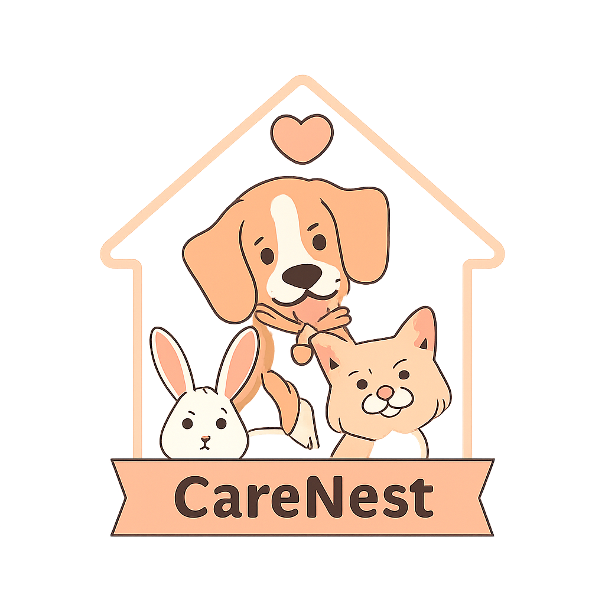
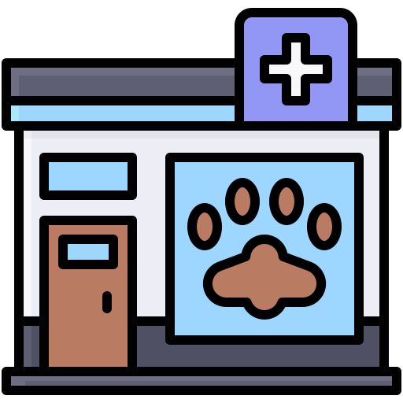

# CareNest - Ứng dụng chăm sóc thú cưng

<div align="center">
  

  **Ứng dụng toàn diện cho việc chăm sóc thú cưng của bạn**

  [](https://flutter.dev)

## 🎨 Giao diện

### Màn hình chính

<table>
  <tr>
    <td align="center">
      
      <br>
      <b>Giao diện ứng dụng CareNest</b>
    </td>
  </tr>
</table>

### Các màn hình khác

<table>
  <tr>
    <td align="center">
      
      <br>
      <b>Trang chủ</b>
    </td>
    <td align="center">
      
      <br>
      <b>Dịch vụ</b>
    </td>
    <td align="center">
      
      <br>
      <b>Chức năng</b>
    </td>
  </tr>
  <tr>
    <td align="center">
      
      <br>
      <b>AI Assistant</b>
    </td>
    <td align="center">
      
      <br>
      <b>Gia đình</b>
    </td>
    <td align="center">
      
      <br>
      <b>Cá nhân</b>
    </td>
  </tr>
</table>

## 🚀 Cài đặt và chạy

### Yêu cầu hệ thống

- Flutter SDK >= 3.0.0
- Dart SDK >= 3.0.0
- Android Studio / VS Code
- Android SDK hoặc iOS SDK

### Cài đặt

```bash
# Clone repository
git clone https://github.com/EXE101-CareNest/mobile.git
cd mobile

# Cài đặt dependencies
flutter pub get

# Chạy ứng dụng
flutter run
```

## 📁 Cấu trúc project

```
lib/
├── main.dart                 # Entry point
├── component/
│   ├── app_bar.dart         # Custom app bar
│   └── bottom_bar.dart      # Stylish bottom navigation
├── core/                    # Core utilities
├── dto/                     # Data transfer objects
├── model/                   # Data models
├── route/                   # App routing
├── screens/                 # UI screens
├── service/                 # Business logic
└── widget/                  # Reusable widgets

assets/
├── images/                  # App images
│   ├── logo.png
│   ├── Home1.png - Home6.png
│   └── sharingan/
└── ...
```

## 👥 Đội ngũ phát triển

- **Team**: EXE101-CareNest
- **Repository**: [mobile](https://github.com/EXE101-CareNest/mobile)

## 📄 License

Dự án này được phát triển cho mục đích học tập và nghiên cứu.

---

<div align="center">
  <p>Được phát triển với ❤️ bởi đội ngũ CareNest</p>

  **Chăm sóc thú cưng - Yêu thương trọn vẹn** 🐾

</div>
